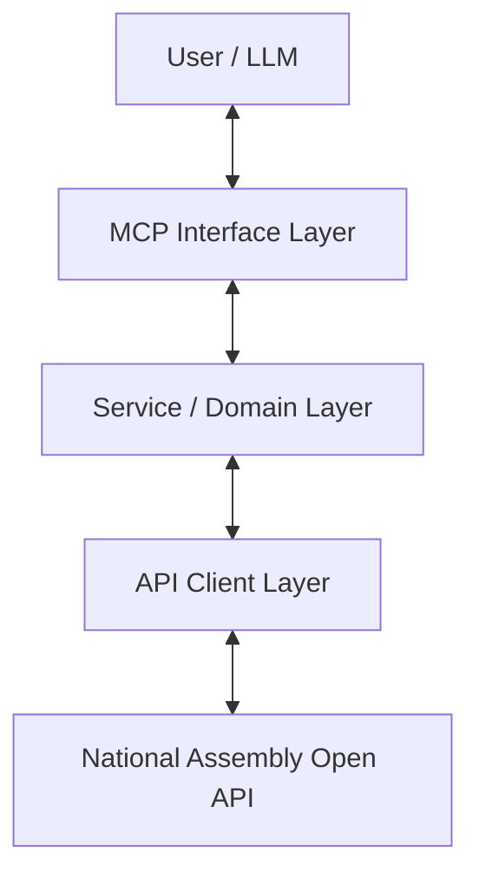

# AssemblyMCP Architecture Guide

This document outlines the architectural design for the AssemblyMCP project. It serves as a guide for developers and agents adding new features or maintaining the codebase.

## 1. High-Level Overview

The project follows a **Layered Architecture** to separate concerns between raw API communication, domain logic, and the MCP interface.



## 2. Layer Definitions

### 2.1. API Client Layer (`src/client`)
**Responsibility:** Reliable communication with the external Open API.
*   **Component:** `AssemblyAPIClient`
*   **Key Features:**
    *   **Dynamic Spec Loading:** Loads `specs/*.json` to validate Service IDs and understand API capabilities at runtime.
    *   **Resilience:** Handles retries, timeouts, and network errors (using `tenacity`).
    *   **Protocol Translation:** Handles authentication (`KEY`), format selection (JSON/XML), and standardizes error responses.
    *   **Agnostic:** Does *not* know about "Bills" or "Members" specifically, only "Service IDs" and "Parameters".

### 2.2. Service / Domain Layer (`src/services`)
**Responsibility:** Business logic, data aggregation, and transformation.
*   **Concept:** Group related functionality into Services (e.g., `BillService`, `MemberService`, `MeetingService`) matching the groups in `api_analysis.md`.
*   **Key Features:**
    *   **Abstraction:** Hides the complexity of multiple API calls. For example, `get_member_details` might call 3 different raw APIs.
    *   **Transformation:** Converts raw dictionary responses from the Client into typed Pydantic models (`src/models`).
    *   **Logic:** Handles filtering, sorting, and joining data that the raw API doesn't support natively.
    *   **Caching:** (Future) Implements caching strategies appropriate for the data type.

### 2.3. Model Layer (`src/models`)
**Responsibility:** Type definitions and data validation.
*   **Component:** Pydantic Models (e.g., `Bill`, `Member`, `Committee`).
*   **Key Features:**
    *   **Type Safety:** Ensures data passed between layers is valid.
    *   **Documentation:** Docstrings on models serve as documentation for the LLM when exposed via MCP.

### 2.4. MCP Interface Layer (`src/assemblymcp`)
**Responsibility:** Exposing functionality to the LLM via the Model Context Protocol.
*   **Component:** `FastMCP` server and tool definitions.
*   **Key Features:**
    *   **Thin Wrappers:** Tools should be simple wrappers around Service methods. Avoid putting complex logic here.
    *   **Context Awareness:** Formats Service responses into human-readable text or structured data optimized for LLM consumption.
    *   **Error Handling:** Catches Service exceptions and returns helpful error messages to the LLM.

## 3. Development Workflow

When adding a new feature (e.g., "Search Meeting Records"):

1.  **Analyze Specs:** Check `specs/` or `api_analysis.md` to find the relevant raw Service IDs (e.g., `OO1X9P001017YF13038` for Plenary Session).
2.  **Define Model:** Create or update a Pydantic model in `src/models/` (e.g., `MeetingRecord`).
3.  **Implement Service:**
    *   Create `src/services/meeting_service.py`.
    *   Inject `AssemblyAPIClient`.
    *   Implement a method `search_meetings(...)` that calls `client.get_data(...)` and returns `List[MeetingRecord]`.
4.  **Expose Tool:**
    *   Update `assemblymcp/server.py` (or split into `assemblymcp/tools/`).
    *   Register a new `@mcp.tool` that calls `meeting_service.search_meetings(...)`.

## 4. Key Design Decisions

### Dynamic vs. Static
*   **Specs are Dynamic:** We load the huge JSON specs dynamically to validate Service IDs and avoid hardcoding thousands of magic strings.
*   **Models are Static:** We define Pydantic models statically. This provides better developer experience (IDE support) and allows FastMCP to generate accurate schemas for the LLM.

### Error Handling Strategy
1.  **Client Layer:** Retries transient errors. Raises `AssemblyAPIError` for API-level failures (e.g., invalid key, 500 error).
2.  **Service Layer:** Catches `AssemblyAPIError`. Can re-raise or handle specific cases (e.g., treating "No Data" code as an empty list).
3.  **MCP Layer:** Catches all exceptions. Returns a user-friendly string to the LLM (e.g., "I couldn't find any meeting records for that date. (Error: API timeout)").

## 5. Directory Structure

```
AssemblyMCP/
├── docs/               # Documentation
├── specs/              # Raw Open API Specifications (JSON)
├── src/
│   ├── client/         # AssemblyAPIClient (Low-level)
│   ├── models/         # Pydantic Models (Data Types)
│   ├── services/       # Business Logic (The "Brain")
│   └── assemblymcp/    # MCP Server & Tools (The Interface)
└── tests/              # Unit and Integration Tests
```
